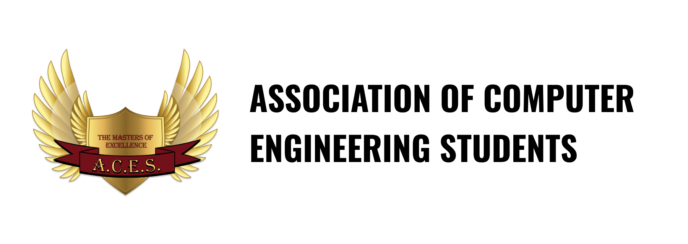

# Up for Contributions
References to external repositories for contributing in Hacktoberfest 2023

## From DIT, Pimpri

### NoteAttendance
By: [Shreedhar Urawane](google.com)

A full-stack ecommerce web application built using the MERN (MongoDB, Express.js, React, Node.js) stack. It is designed to provide a seamless online shopping experience for both customers and administrators. With UrbanCart, you can easily create and manage your online store, list products, handle customer orders, and more.

[https://github.com/Shreedhar03/UrbanCart](https://github.com/Shreedhar03/UrbanCart)

### NoteAttendance
By: [Shreedhar Urawane](google.com)

A full-stack ecommerce web application built using the MERN (MongoDB, Express.js, React, Node.js) stack. It is designed to provide a seamless online shopping experience for both customers and administrators. With UrbanCart, you can easily create and manage your online store, list products, handle customer orders, and more.

[https://github.com/Shreedhar03/UrbanCart](https://github.com/Shreedhar03/UrbanCart)
### NoteAttendance
By: [Shreedhar Urawane](google.com)

A full-stack ecommerce web application built using the MERN (MongoDB, Express.js, React, Node.js) stack. It is designed to provide a seamless online shopping experience for both customers and administrators. With UrbanCart, you can easily create and manage your online store, list products, handle customer orders, and more.

[https://github.com/Shreedhar03/UrbanCart](https://github.com/Shreedhar03/UrbanCart)

\
_A project by Association of Computer Engineering Students, [DIT Pimpri](https://engg.dypvp.edu.in/)_

